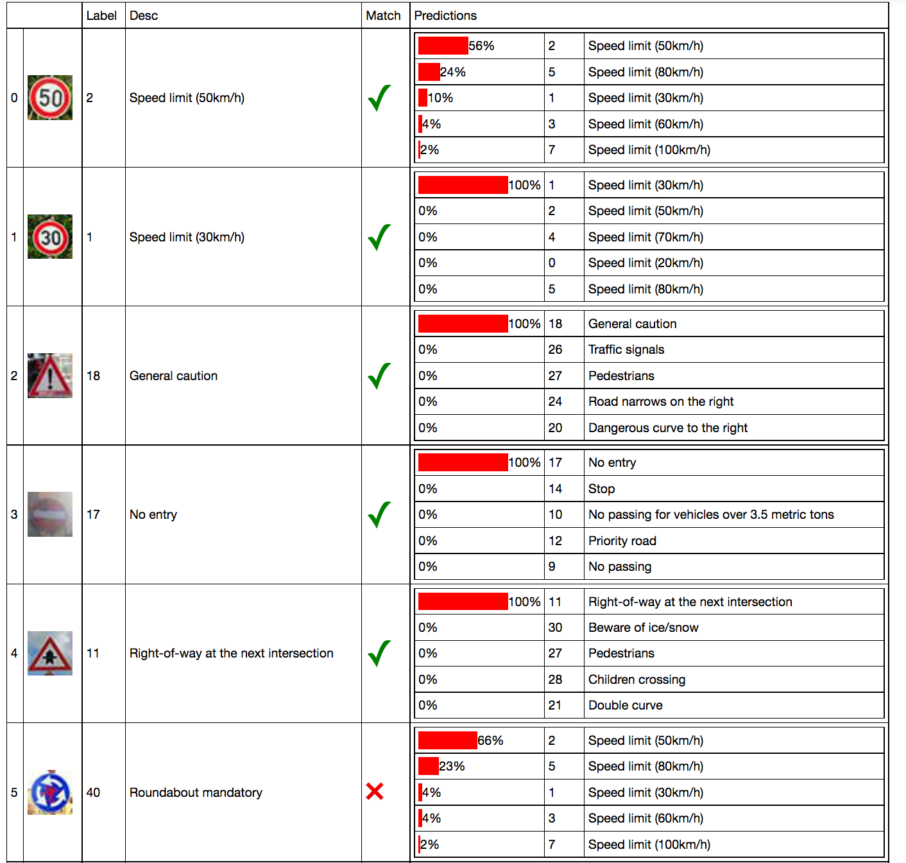
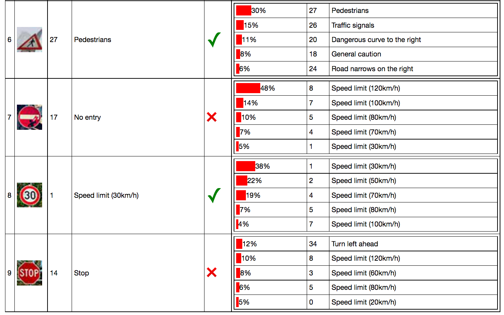

# **Traffic Sign Recognition** 

# **Build a Traffic Sign Recognition Project**

The goals / steps of this project are the following:
* Load the data set (see below for links to the project data set)
* Explore, summarize and visualize the data set
* Design, train and test a model architecture
* Use the model to make predictions on new images
* Analyze the softmax probabilities of the new images
* Summarize the results with a written report

[//]: # (Image References)

[new_table1]: ./writeup_images/new_table1.png
[new_table2]: ./writeup_images/new_table2.png
[explor]: ./writeup_images/explor.png 
[plot]: ./writeup_images/plot.png 

### Writeup / README

#### 1. Provide a Writeup / README that includes all the rubric points and how you addressed each one. You can submit your writeup as markdown or pdf. You can use this template as a guide for writing the report. The submission includes the project code.

You're reading it! and here is a link to my [project code](https://github.com/cesare-montresor/CarND-Traffic-Sign-Classifier-Project/blob/master/Traffic_Sign_Classifier.ipynb)
	
### Data Set Summary & Exploration

#### 1. Provide a basic summary of the data set and identify where in your code the summary was done. In the code, the analysis should be done using python, numpy and/or pandas methods rather than hardcoding results manually.

The code for this step is contained in the second code cell of the IPython notebook.  

I calculate summary statistics of the traffic signs dataset:

* Number of training examples = 34799
* Number of testing examples = 12630
* Image shape = 32x32x3
* Number of classes = 43

Is also provided a summary about the size of each class and in proportion to the dataset. This information is provided via bar chart for visual understanding and tabular data for a more in detail exploration.
The information provided in such a way is useful to spot skewed classes.

#### 2. Include an exploratory visualization of the dataset and identify where the code is in your code file.

The code for this step is contained in the third code cell of the IPython notebook.  

This step provide a simple way to have a look into the training set, the cell can be run multiple times to review new random samples.

![plot][plot]
![Exploration][explor]

### Design and Test a Model Architecture

#### 1. Describe how, and identify where in your code, you preprocessed the image data. What tecniques were chosen and why did you choose these techniques? Consider including images showing the output of each preprocessing technique. Pre-processing refers to techniques such as converting to grayscale, normalization, etc.

- In the attempt to "normalize" the lighting condition I've been adding a histagram normalization on the Y (YCrCb) channel
- I switch changed the color space to YCrCb as it provides a grayscale equivalent as Y channel, without the need of "dumping" the color information.
- Then images are numerically normalized per image, to speedup the optimizer.

#### 2. Describe how, and identify where in your code, you set up training, validation and testing data. How much data was in each set? Explain what techniques were used to split the data into these sets. (OPTIONAL: As described in the "Stand Out Suggestions" part of the rubric, if you generated additional data for training, describe why you decided to generate additional data, how you generated the data, identify where in your code, and provide example images of the additional data)

The code to load the 3 dataset is located in the first cell of the iPython notebook, along with the text description from the signnames.csv.

The model is trained and tested on the provided dataset as is at it comes already conveniently split in train, validation and test set.

At the time being the dataset have not being augmented as I wanted to spend more time into other aspects of Tensorflow and the architecture of neural networks.
If I would have done it I would used transformation and color degradation, single or in combination, to generate additional data for all classes while using it as a mean to reduce the gap between classes.

#### 3. Describe, and identify where in your code, what your final model architecture looks like including model type, layers, layer sizes, connectivity, etc.) Consider including a diagram and/or table describing the final model.

The code for my final model is located in the in the 7th cell, however the code relative to the implementation of network layers and assembly can be found in the 5th cell. The code relative to the training in the 6th cell.

The following architecture is the result of a trial and error process starting from the LeNet5, most of the architectural choices have been made based on an improvement in the accuracy.
Keeping in mind the little I know about other famous architectures, I've tried to make my network "deep" rather then "wide".
The following code represents the sum of the hyperparameters of the delivered solution, in can be found in the 7th cell. Under the section "model" it can be found a concise version of the network architecture.

    hyperparams ={
        "epochs": 60,
        "batch_size": 32,

        'rate': 0.001, #starting rate
        'rate_step': 0.1, #between 0 and 1 to make it decrease over time. Set to 1 to disable it.
        'rate_change_limit': 0.001, #currently last5 avg5

        "n_classes": n_classes,
        "defaults":{
            "mu": 0,
            "sigma": 0.1,
            "keep_prob": 0.8,
        },

        "model": [
            { "kind": "conv", "depth": 10 },
            { "kind": "conv", "depth": 20 },
            { "kind": "pool", "padding": "VALID" },
            { "kind": "conv", "depth": 40, "padding": "VALID" },
            { "kind": "conv", "depth": 60, "padding": "VALID" },
            { "kind": "pool", "padding": "VALID" },
            { "kind": "conv", "depth": 80, "padding": "VALID" },
            { "kind": "flat" }, 
            { "kind": "fc", "size": 600, "keep_prob": 0.6}, 
            { "kind": "fc", "size": 400, "keep_prob": 0.6},
            { "kind": "fc", "size": 200, "keep_prob": 0.6}, 
            { "kind": "fc", "size": 100, "keep_prob": 0.6}, 
            { "kind": "fc", "size": n_classes, "keep_prob": 1.0, "activation": False}

        ]
    } 

Upon running the following output is produced to review the sizes of each layer for the current configuration:

	input      :	 (?, 32, 32, 3) 	 3072
	0_conv     :	 (?, 32, 32, 10) 	 10240
	1_conv     :	 (?, 32, 32, 20) 	 20480
	2_pool     :	 (?, 16, 16, 20) 	 5120
	3_conv     :	 (?, 14, 14, 40) 	 7840
	4_conv     :	 (?, 12, 12, 60) 	 8640
	5_pool     :	 (?, 6, 6, 60) 	 2160
	6_conv     :	 (?, 4, 4, 80) 	 1280
	7_flat     :	 (?, 1280) 	 1280
	8_fc       :	 (?, 600) 	 600
	9_fc       :	 (?, 400) 	 400
	10_fc      :	 (?, 200) 	 200
	11_fc      :	 (?, 100) 	 100
	12_fc      :	 (?, 43) 	 43

It can be described as follows. The model have been trained for 40 epochs using a batch size of 32.
The starting learning rate is 0.001, "increased" with an step of 0.1, when the average increment in accuracy of the last 5 epochs goes below 0.001.
The default initialisation for the weights is random float with mu of 0 and sigma 0.1, the default keep_prob for the activation layers is 0.8
As for the model, it has the following structure:

- Convolution with 10 filters
- Convolution with 20 filters
- Max Pool with valid padding
- Convolution with 40 filters and valid padding
- Convolution with 60 filters and valid padding
- Max Pool with valid padding
- Convolution with 80 filters and valid padding
- Flat
- Fully-connected of size 600 and keep probability of 0.6
- Fully-connected of size 400 and keep probability of 0.6
- Fully-connected of size 200 and keep probability of 0.6
- Fully-connected of size 100 and keep probability of 0.6
- Output layer with n_classes (43 classes), no activation function and no dropout (in case default a keep_prob is set)

By default the convolutional layers use a 3x3 filter, same padding and stride of 1.
The convolutional layer optionally supports dropout and always apply the activation function (Relu) afterwards. 
The pooling layers, the kernel is 2x2 with a stride of 2 and same padding.

#### 4. Describe how, and identify where in your code, you trained your model. The discussion can include the type of optimizer, the batch size, number of epochs and any hyperparameters such as learning rate.

The code for training the model is located in the 6th cell of the ipython notebook and single function that given the inputs and the hyperparameters as formater about, performs the training of the model, compute accuracy, save the checkpoints  of model and display information about the training. 

At indicated in the comments in the code, the function responsible for training performs the following operations:
* Define the input and the output placeholders
* Feed the placeholder to the BuildNet functions together with the hyperparameters. The build net function returns the logits (tensor), the final model parameters and the list of placeholders and variables by each layer.
* Using the placeholder returned by the previous step 2 feed_dict, one for training and one for validation, are assembled to be later fed to the session. The main difference is that the feed_dict to compute the accuracy as all the placeholder for keep_prob are set to 1.0.
* Using the variables produced by the BuildNet function a dictionary that later will be used to select what variables need to be save in the model.
* Using the logist other operations are prepared, like loss, accuracy and training.
* AdamOptimizer have been chosen as optimization algorithm, with adjusting learning rate (see below).
* The model is trained and the accuracy measured using the batch size specified in the hyperparams.
* At the end of each epochs some statistics are produced and displayed like, the accuracy and the training time. Overtime, I've been trying to find meaningful indicators that can help to identify when the gain accuracy drops, the table show a few of the attempts. 
* The learning rate adjust over time in case the gain in accuracy plateau, in this implementation I've tried several and I ended up choosing a simple indicator such a the average of the delta in accuracy of the last 5 epochs. In my experience it delivers a smoother growth in training and perhaps a few more decimals in accuracy. However it requires to be capped at some point or the training would stop inevitably make the training ineffective.
* The model is saved, Also the hyperparams are saved, together with the essential informations about the current training session (epoch, val. acc.).
* This process is repeated until the completion of all the epochs.
* The final accuracy is produced for the train, validation and test set (added later, as suggested)

My final model results were:
* Train: 0.9992815885513952
* Validation: 0.9897959183673469
* Test: 0.9758511481073671

#### 5. Describe the approach taken for finding a solution. Include in the discussion the results on the training, validation and test sets and where in the code these were calculated. Your approach may have been an iterative process, in which case, outline the steps you took to get to the final solution and why you chose those steps. Perhaps your solution involved an already well known implementation or architecture. In this case, discuss why you think the architecture is suitable for the current problem.

I've been using LeNet5 as base of my neural network, adapt the input and output layer to fit the new dataset and run it, the accouracy of ~0.85 was a good starting
but as this project is one of my first attempt to build a neutral network, I really had little clues on how to structure it. 
After few attempts, I realised that was taking quite a long time to see the effect of tuning just a single parameter as the training requires a long time. 
Also keep changing the the architecture require that network size and shape stay consistent and I personally found it being quite an error-prone process and hard to keep track of.

In order to be able to adjust the network easily and keep track of all the tested architectures, together with the performance obtained, I've decided to standardise my layers and automate the model assembly, so I would have been able to define my model as a set of parameters instead of actual python.

Giving the relatively small size of the network I managed to run it on my personal laptop leveraging the GPU. At the time of writing I've stored more 500 checkpoint (some broken or with very few epochs of training)

Right now, giving the great number of run I've tried and giving the most of the params are numbers nicely placed in a configuration file, I must say they I've entrained the idea of using a second network trying figuring out layers and parameters of the first one, quite fascinating.

### Test a Model on New Images

#### 1. Choose five German traffic signs found on the web and provide them in the report. For each image, discuss what quality or qualities might be difficult to classify.

For the signs 0, 1, 2, 4, 8 I expected a good classification as the image is clean and they belong to well represented classes.

Comes a bit of a surprise the 3rd example as the the traffic sign belongs to a average represented class and the lighting conditions are not optimal, it might be hard to notice, but in the top left corner for the traffic sign have also been painted over. By best guess at this point is that exactly due to the poor lighting conditions, a greater evidence have been to the overall pattern rather then details  making it easier to be identified, as in contrast with sign in the 7th example.

As for the last example, it fail to classify it, but I'm puzzled as the image appear to be clean, perhaps might be a bit noisy due to what looks like a repeated jpeg-compression, the class also might not be particularly well represented (2.0%)

#### 2. Discuss the model's predictions on these new traffic signs and compare the results to predicting on the test set. Identify where in your code predictions were made. At a minimum, discuss what the predictions were, the accuracy on these new predictions, and compare the accuracy to the accuracy on the test set (OPTIONAL: Discuss the results in more detail as described in the "Stand Out Suggestions" part of the rubric).

The code for making predictions on my final model is located in the tenth cell of the Ipython notebook.

I decided to download a few more images, to try to see what kind of image would fail, surprisingly the pattern that emerged among the images that failed is that all of them belong to skewed classes:
| 300 	| 0.9% 	| Roundabout mandatory 	
| 210 	| 0.6% 	| Pedestrians 	
| 690 	| 2.0% 	| Stop 	
| 990 	| 2.8% 	| No entry 	

Where it generally succeeded with better classes:
| 1980 	| 5.7% 	| Speed limit (30km/h) 	
| 2010 	| 5.8% 	| Speed limit (50km/h) 	
| 1170 	| 3.4% 	| Right-of-way at the next intersection 	
| 1080 	| 3.1% 	| General caution

The classification on new images is 7 out of 10, that is a 70% against the 97% reported by the test set, this is due to the fact that some of the images downloaded from internet where intentional chosen because some the actual signpost have been partially painted over (3,5,7), or the picture taken from a different angle (6), further exploration could lead to improvement into how augment the dataset, specefically I'm thinking of partial occlusions. Perhaps also extending the dataset to include more examples for smallest classes, could improve the overall performance.

#### 3. Describe how certain the model is when predicting on each of the five new images by looking at the softmax probabilities for each prediction and identify where in your code softmax probabilities were outputted. Provide the top 5 softmax probabilities for each image along with the sign type of each probability. (OPTIONAL: as described in the "Stand Out Suggestions" part of the rubric, visualizations can also be provided such as bar charts)

The code for making predictions on my final model is located in the last cell of the Ipython notebook.

As shown in the table above, that can be found also in the Ipython notebook, it show good very good confidence for some of the exact matches (1,2,3,4) and sometimes very low for wrong ones (9), which is good. 
However there is also a good number of correct matches with low confidence (0,6,8) and errors with high confidence (5,7), that makes it difficult to make the network really reliable, ideal would be to have very low confidence on wrong matches.

#### Personal conclusion

Even if in this project I've been putting more effort on the architectural aspect of the netural network due to a personal interest, I must say by looking at the final results of this writeup that exploring and taking care (unskew and augument) of the dataset is essential and it can really smoothen the learning process while delivering a quite robust result against new images.
